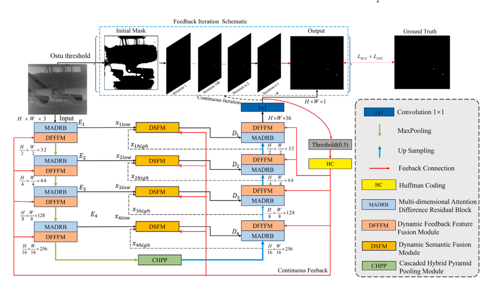
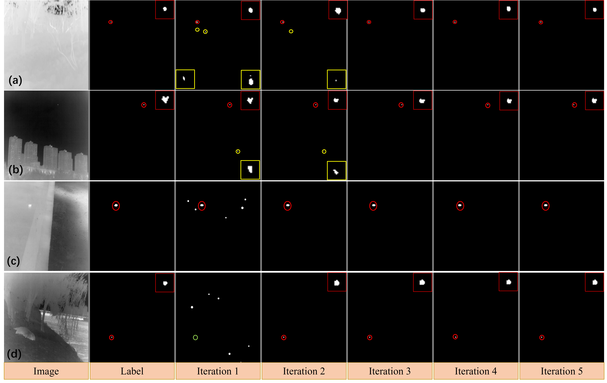

#DFINet: Dynamic feedback iterative network for infrared small target detection 
paper：https://www.sciencedirect.com/science/article/abs/pii/S0031320325006181

## Framework of DFINet

  

## Visual

  

